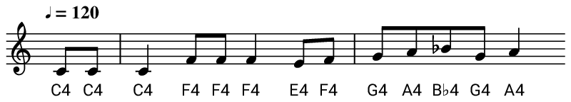
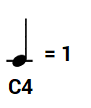
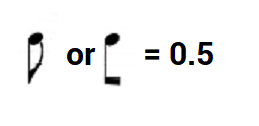
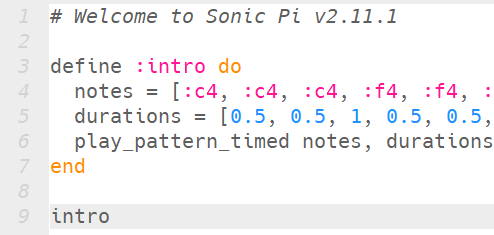

## Code the introduction

The introduction is the melody associated with the words _"On the third day of Christmas, my true love sent to me"_.

<div id="audio-preview" class="pdf-hidden">

<audio controls preload>
  <source src="resources/intro.mp3" type="audio/mpeg">
Your browser does not support the <code>audio</code> element.
</audio>

</div>

Let's create a function to play this music in Sonic Pi.

+ Open up Sonic Pi and choose an empty buffer to write your code in.

+ Define a function called `:intro` — it will not contain any code for the moment.

[[[generic-sonicpi-function]]]

+ Inside the function, create two **lists**. One should be called `notes` and one should be called `durations`. You will use these lists to store the notes for the introduction.

```ruby
notes = []
durations = []
```

Here is the melody you will need, and don't worry if you can't read music, as we have labelled each note. C4 means the note C in octave 4, which is how Sonic Pi refers to notes.



+ Look at the music notes above. Add each of the note names to the `notes` list, separated by a comma. The first two notes are C4, and in Sonic Pi we would write this as `:c4`.

```ruby
notes = [:c4, :c4]
```

You might have noticed that one of the notes is called B♭4 (B flat). You can write this note in Sonic Pi as `:bb4`.

+ Next, add the durations of each note to the `durations` list.

Notes which are not joined are called **crotchets** and will last for one beat (`1`).



Notes with a tail or joined together with a beam are called **quavers** and will last for half a beat (`0.5`).



It does not matter which way up the notes are.

So the first two durations would be:

```ruby
durations = [0.5, 0.5]
```

--- hints ---
--- hint ---
Here is the first part of the code - can you continue from here?

```ruby
define :intro do
    notes = [:c4, :c4, :c4, :f4, :f4, :f4]
    durations = [0.5, 0.5, 1, 0.5, 0.5, 1]
end
```
--- /hint ---
--- hint ---
Here is the full code you will need:

```ruby
define :intro do
    notes = [:c4, :c4, :c4, :f4, :f4, :f4, :e4, :f4, :g4, :a4, :bb4, :g4, :a4]
    durations = [0.5, 0.5, 1, 0.5, 0.5, 1, 0.5, 0.5, 0.5, 0.5, 0.5, 0.5, 1]
end
```
--- /hint ---
--- /hints ---

+ Add an instruction on the last line inside your function to play the pattern of notes you have created.

```ruby
play_pattern_timed notes, durations
```

+ Run your program. Nothing will happen! To hear your melody, you will need to **call** the function by typing `intro` right at the bottom of your program, leaving out the `:`.


