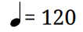
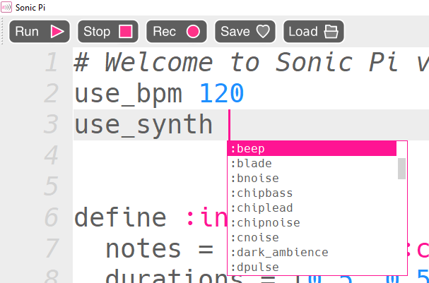

## Speed and synths

Your intro probably sounds a little slow and sombre at the moment. You can change how it sounds by altering the speed (known as the tempo) and the instrument used to play the music.

Did you notice this symbol on the intro music? This is the speed at which the piece is supposed to be played.



+ At the start of your program, add this code to tell the music to play at 120BPM (beats per minute):

```ruby
use_bpm 120
```

+ Run your code again — it should sound better already!

Now let's change the instrument. Sonic Pi has lots of instruments called **synths** for you to choose from.

+ Underneath your `use_bpm` instruction, type `use_synth` and then press the **space** bar. You should see a list of synths pop up:



+ Choose one you think sounds interesting, and then run your music. If you don't like it, delete the synth and choose a different one until you find something you like.

We used the `:pulse` synth for the example music at the start of this project.
