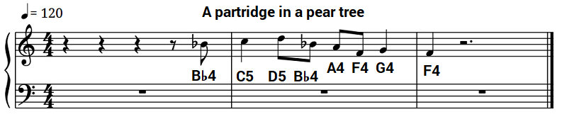

## Code the partridge

Now that you know how to create a function to play a piece of music, have a go at coding the melody for the line _"a partridge in a pear tree"_.

<div id="audio-preview" class="pdf-hidden">

<audio controls preload>
  <source src="resources/partridge.mp3" type="audio/mpeg">
Your browser does not support the <code>audio</code> element.
</audio>

</div>

Put your code inside a function called `:partridge`.



--- hints ---
--- hint ---
Start by creating a function called `partridge`

```ruby
define :partridge do

end
```
--- /hint ---
--- hint ---
Add your `notes` and `durations` to the lists:

```ruby
notes = []
durations = []
```

Then play the melody:

```ruby
play_pattern_timed notes, durations
```
--- /hint ---
--- hint ---
Here is the code you will need:

```ruby
define :partridge do
  notes = [:bb4, :c5, :d5, :bb4, :a4, :f4, :g4, :f4]
  durations = [0.5, 1, 0.5, 0.5, 0.5, 0.5, 1, 1]
  play_pattern_timed notes, durations
end
```

Don't forget to **call** your function by typing `partridge` at the bottom of your code, or you won't hear anything!
--- /hint ---
--- /hints ---

+ Add a call to your partridge function at the end of your program, so that you have the following:

```ruby
intro
partridge
```

Run the code and you should hear the melody for the first full verse of the song:

_"On the first day of Christmas, my true love sent to me
A partridge in a pear tree."_

+ You may have noticed that the `partridge` melody starts a little too early. You can pause briefly between calling the two functions with `sleep` to fix this:

```ruby
intro
sleep 0.5
partridge
```
