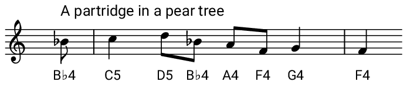

## Code the partridge

Now that you know how to create a function to play a piece of music, have a go at coding the melody for the line _"a partridge in a pear tree"_.

Put your code inside a function called `:partridge`.



--- hints ---
--- hint ---
Start by creating a function called `partridge`

```ruby
define :partridge do

end
```
--- /hint ---
--- hint ---
Add your `notes` and `durations` to the lists:

```ruby
notes = []
durations = []
```

Then add ` play_pattern_timed notes, durations`.
--- /hint ---
--- hint ---
Here is the code you will need:

```ruby
define :partridge do
  notes = [:bb4, :c5, :d5, :bb4, :a4, :f4, :g4, :f4]
  durations = [0.5, 1, 0.5, 0.5, 0.5, 0.5, 1, 1]
  play_pattern_timed notes, durations
end
```
--- /hint ---
--- /hints ---
