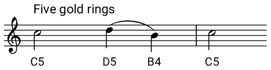

## Code the other parts

Now it's time to code functions for the other parts of the song! They are:

- **Item** - e.g. _"Nine ladies dancing"_
- **Five gold rings**
- **Four three two** - the melody of the verses four, three and two changes if the verse we are currently on contains five or more items.

+ Create three more functions in exactly the same way, one for each of these parts.

You'll notice another type of note here. This note is called a **minim** and will last for 2 beats.

**Tip**: You might wish to test out your function in a different buffer to see if it sounds right before adding it to your main program.

<audio controls preload>
  <source src="resources/item.mp3" type="audio/mpeg">
Your browser does not support the <code>audio</code> element.
</audio>

<audio controls preload>
  <source src="resources/fivegoldrings.mp3" type="audio/mpeg">
Your browser does not support the <code>audio</code> element.
</audio>

<audio controls preload>
  <source src="resources/fourthreetwo.mp3" type="audio/mpeg">
Your browser does not support the <code>audio</code> element.
</audio>

