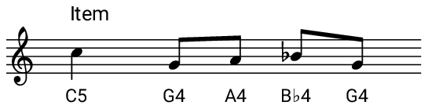
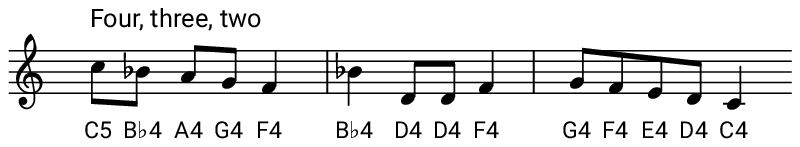

## Code the other parts

Now it's time to code functions for the other parts of the song! They are:

- **Item** - e.g. _"Nine ladies dancing"_
- **Five gold rings**
- **Four, three, two** - the melody of the verses four, three and two changes if the verse we are currently on contains five or more items.

+ Create three more functions in exactly the same way, one for each of these parts.

You'll notice another type of note here. This note is called a **minim** and will last for 2 beats.


**Tip**: You might wish to test out your function in a different buffer to see if it sounds right before adding it to your main program.



<div id="audio-preview" class="pdf-hidden">

<audio controls preload>
  <source src="resources/item.mp3" type="audio/mpeg">
Your browser does not support the <code>audio</code> element.
</audio>

</div>


<div id="audio-preview" class="pdf-hidden">

<audio controls preload>
  <source src="resources/fivegoldrings.mp3" type="audio/mpeg">
Your browser does not support the <code>audio</code> element.
</audio>

</div>



<div id="audio-preview" class="pdf-hidden">

<audio controls preload>
  <source src="resources/four-three-two.mp3" type="audio/mpeg">
Your browser does not support the <code>audio</code> element.
</audio>

</div>

--- hints ---
--- hint ---
Here is the code for **Item**:

```ruby
define :item do
  notes = [:c5, :g4, :a4, :bb4, :g4]
  durations = [1, 0.5, 0.5, 0.5, 0.5]
  play_pattern_timed notes, durations
end
```
--- /hint ---
--- hint ---
Here is the code for **Five gold rings**:

```ruby
define :five_gold_rings do
  notes = [:c5, :d5, :b4, :c5]
  durations = [2, 1, 1, 2]
  play_pattern_timed notes, durations
  sleep 0.5
end
```
--- /hint ---
--- hint ---
Here is the code for **Four, three, two**:

```ruby
define :four_three_two do
  notes = [:c5, :bb4, :a4, :g4, :f4, :bb4, :d4, :d4, :f4, :g4, :f4, :e4, :d4, :c4]
  durations = [0.5, 0.5, 0.5, 0.5, 1, 1, 0.5, 0.5, 1, 0.5, 0.5, 0.5, 0.5, 1]
  play_pattern_timed notes, durations
end
```
--- /hint ---
--- /hints ---
