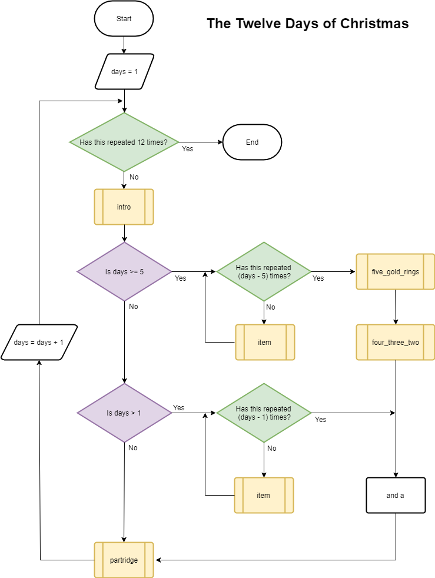

## Challenge: code the song

Writing the song by interpreting a flow chart is an optional challenge. If you would prefer to follow step-by-step instructions for how to write the code instead, move on to the next step. 

--- challenge ---

Now that you have all of the parts of the song, it's time to put it together. You will be able to recreate all twelve verses of the song using just the functions you have already written and a bit of logic!

Here is a flow chart showing an algorithm that will generate the entire song:

[Download the flow chart as a PDF](resources/flowchart.pdf)

Can you use the flow chart to write the song?

- **Yellow** boxes represent the functions you have written
- **Green** boxes represent loops (e.g. `12.times do`)
- **Purple** boxes represent decisions (e.g. `if days >= 5`)

The **and a** box is where you need to add a single note to represent the _"and"_ in _"**and** a partridge in a pear tree"_. This is because the first partridge doesn't have an _"and"_!

--- /challenge ---
