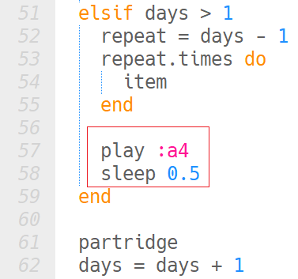

## The song step by step

<iframe width="560" height="315" src="https://www.youtube.com/embed/YzJjSXXo1mw?rel=0" frameborder="0" gesture="media" allow="encrypted-media" allowfullscreen></iframe>

+ At the bottom of your code, below your functions, remove any calls to the functions that may be left over from when you tested them.

+ Create a variable called `days` and set its value to `1`.

```ruby
days = 1
```

+ Next, create a loop that runs 12 times, once for each verse of the song.

```ruby
12.times do

end
```

Now let's start building up the song. Instead of calling each function over and over, which would make a very long program, we can use some logic to decide which part to play when and how many times to repeat them.

+ We already know that the introduction and the _"partridge in a pear tree"_ happen in every verse, so add a call to your `intro` and `partridge` functions inside the loop.

```ruby
12.times do
    intro
    partridge
end
```

Now let's think about the other days, starting with the 12th day.

+ Days 12 to 6 have the same melody — the one inside our `item` function.
+ Day 5 has a special melody — the `five_gold_rings`
+ Days 4 to 2 have the same melody as `item` if we hear them as part of a verse number less than 5, but they have the special `four_three_two` melody if they happen after `five_gold_rings`.

+ Add some code between the `intro` and the `partridge` to test whether the value of `days` is `5` or larger:

```ruby
12.times do
    intro
    if days >= 5

    end
    partridge
end
```

If it is, you need to play the `item` melody the correct number of times. If it is day 12, for example, this will be 7 times (for days 12, 11, 10, 9, 8, 7 and 6). You can work out the correct number of times to repeat by taking the number of days minus 5, because the last 5 days are handled differently.

+ Add some code to work out how many times to play the `item` melody, then repeat it that many times:

```ruby
if days >= 5
    repeat = days - 5
    repeat.times do
      item
    end
end
```

+ Immediately after the code finishes repeating `item`, add the code to play the `five_gold_rings` and the special `four_three_two` melody.

+ Run your code. You will hear the intro and the partridge, but no items. This is because the `days` variable equals `1`. Change the value of the variable to a number between `12` and `5`, and check that you hear the right melody for the day you selected.

+ Once you are finished testing, change the days variable back to `1`.

Now you just need to handle days 4 to 2.

+ Below the `four_three_two` line, add an `elsif` to handle these days. The code has already decided that `days` is less than `5` (otherwise this check wouldn't be happening), so you only need to check whether `days` is greater than `1` to be sure to capture days 4 to 2.

```ruby
elsif days > 1

```

+ This time, you want the `item` melody to repeat in the same way as it did for days 12 to 5. You can calculate how many times you want it to repeat by taking the number of `days` minus `1` (because we don't need to play it for the partridge day).

```ruby
elsif days > 1
    repeat = days - 1
    repeat.times do
        item
    end
```

+ Finally, find the part of your code where you call the `partridge` function — this is the end of the verse. Right below it, create a new line where you add `1` to the `days` variable.

```ruby
days = days + 1
```
This way, `days` increases every time the loop runs, so that that the verse for every day is played correctly.

+ Run your code and check that you hear the right song.

You might notice that the song gets a little out of sync. This is because there is supposed to be a brief pause between verses. You can rectify this by adding in a `sleep` command at the end of your functions to create a brief pause.

+ Add this code at the end of your `intro` function to pause for half a beat:

```ruby
sleep 0.5
```

+ Play the song again and listen for the brief pause between the end of the introduction melody and the beginning of the partridge melody.

+ Add a pause to the end of the `partridge` and `five_gold_rings` functions. Experiment with different pause lengths (`0.5, 1, 2`, etc.) until you find the one that sounds right.

You may also have noticed that we didn't yet add the note to represent _"and"_ which comes in from verse 2 onwards when we need to say "_**and**_ a partridge in a pear tree".

+ Add some code to play a single note for half a beat (`0.5`) if we are on any number of `days` that is greater than `1`:



+ Run your code again and check that the song plays correctly.
